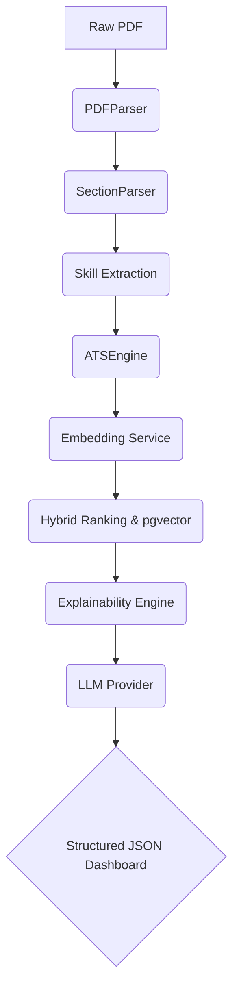

# ResumeIQ: Enterprise AI Retrieval Platform

ResumeIQ is a production-grade AI platform designed to analyze, score, and rank resumes against job descriptions using deterministic explainability, Hybrid Vector Search (`pgvector`), and Large Language Models.

## 🌟 Key Features
- **Deterministic Explainability**: Computes skill gaps and ATS matches natively before utilizing the LLM.
- **Hybrid Semantic Search**: Leverages `pgvector` for embedding similarity search combined with rule-based ATS scoring.
- **Enterprise Architecture**: Built using the Repository Pattern, Dependency Injection, and Abstract Interfaces.
- **Multi-Container Infrastructure**: Fully dockerized with FastAPI, Streamlit, and Postgres (with Alembic migrations).
- **Observability**: Health checks, versioning, and latency metrics tracking.

## 🏗 System Architecture


## 📁 Repository Structure
```text
ResumeIQ/
├── backend/          # FastAPI REST API & SQLAlchemy Repositories
├── frontend/         # Streamlit Explainable Dashboard
├── shared/           # Domain models, Orchestrator, AI Services, DI
├── config/           # Pydantic Settings, Features, Dependencies
├── docs/             # Architecture Decision Records (ADRs)
├── scripts/          # CLI Tools (resumeiq analyze)
├── infra/            # Docker, docker-compose
└── .github/          # CI/CD Actions (Ruff, MyPy, Pytest)
```

## 🚀 Quick Start
```bash
# Clone the repository
git clone https://github.com/rohith-chitturi/ResumeIQ.git
cd ResumeIQ/infra

# Spin up the AI Platform
docker-compose up --build
```
- **Streamlit Dashboard**: `http://localhost:8501`
- **FastAPI Swagger API**: `http://localhost:8000/docs`

## 📊 API Endpoints
- `GET /health`
- `GET /metrics`
- `POST /api/v1/analyze` (End-to-End Analysis)
- `POST /api/v1/batch-analyze` (Async Batch Processing)
