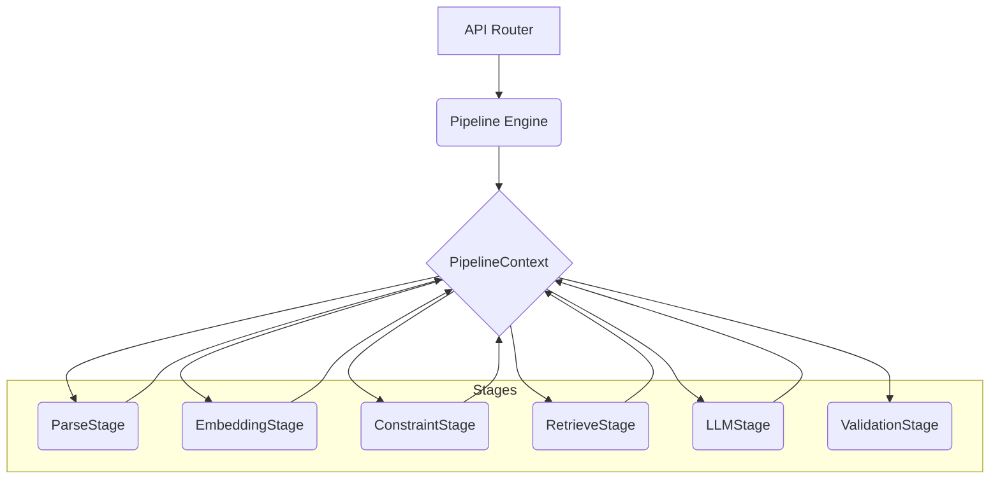

# ResumeIQ: Enterprise AI Platform

ResumeIQ is a scalable, loosely-coupled AI Retrieval Platform. It evaluates resumes against job descriptions using semantic embeddings, deterministic ATS scoring, hybrid vector search (pgvector), and a fully decoupled RAG Pipeline architecture.

## 🏗️ System Architecture

ResumeIQ abandons the monolithic "LLM script" approach in favor of a mature **Pipeline Context Engine**. 



### Key Architectural Tradeoffs
* **Why pgvector?** To perform mathematically precise similarity search within the same database engine holding relational candidate data, completely eliminating the need for a separate vector database (e.g., Pinecone).
* **Why Pipeline Context?** By passing a single `PipelineContext` across atomic stages (`Parse`, `Constraint`, `LLM`), we prevent parameter-bloat and isolate side-effects. This architecture is structurally similar to robust ML frameworks like LangChain without the massive overhead.
* **Why Hybrid Retrieval?** Relying purely on semantic search misses critical exact-match keywords (e.g., "Kubernetes"). We implemented a deterministic Gap Analysis (`ExplainabilityEngine`) to explicitly calculate exact-match missing skills *before* handing context to the LLM.

## 🚀 Core Features
1. **Resume Tailoring Pipeline**: Dynamically extracts constraints and re-writes the resume.
2. **Recruiter Simulator Pipeline**: Evaluates candidates concurrently against 3 distinct personas (ATS Bot, Engineering Manager, HR).
3. **Multi-Job Optimization**: A pure deterministic (no-LLM) batch processor that matches 1 candidate against 10+ jobs to rapidly identify the highest probability role.
4. **Production RAG Engine**: Retrieves FAANG formatting best practices and injects them into the context before generating LLM outputs.
5. **Decoupled Observability**: Stages emit `PipelineEvents` that independent listeners catch for latency tracking and MLOps benchmarking.

## 🛠️ Installation & Setup
```bash
# Clone the repository
git clone https://github.com/rohith-chitturi/ResumeIQ.git
cd ResumeIQ

# Start PostgreSQL + pgvector
docker-compose up -d

# Install dependencies and start the API
pip install -r requirements.txt
uvicorn backend.api.main:app --reload
```

## 🗺️ Version Roadmap
* **v1.0**: Production Base (FastAPI, pgvector, Provider Interfaces)
* **v2.0**: Pipeline Architecture & Events
* **v2.2**: Resume Intelligence & Simulator
* **v2.4**: RAG Engine Integration
* **v2.5 (Current)**: MLOps Experiment Tracking
* **v3.0**: Frozen.
