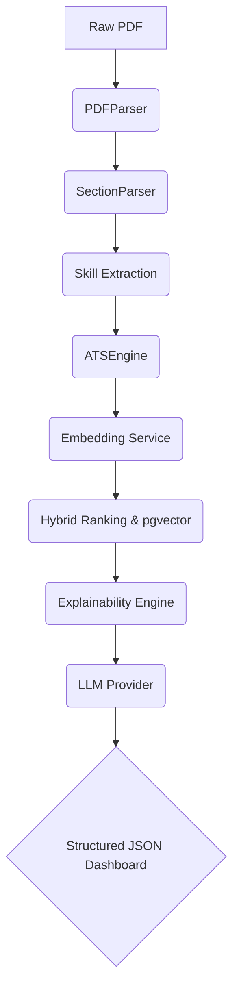

# ResumeIQ

ResumeIQ is an AI Retrieval Platform that analyzes resumes against job descriptions using semantic embeddings, deterministic ATS scoring, hybrid vector search, and LLM-powered recommendations. The platform combines explainable AI with a modular backend architecture to demonstrate modern AI engineering practices.

## System Architecture



## Concrete Capabilities

- **FastAPI Backend**: Asynchronous REST API managing the orchestration layer.
- **PostgreSQL + pgvector**: Stores resume embeddings and performs fast similarity searches.
- **Hybrid Semantic Retrieval**: Combines pgvector cosine distance (70%) with rule-based ATS scoring (30%).
- **Explainable ATS Scoring**: A deterministic Explainability Engine computes missing skills and match metrics natively.
- **Modular Provider Interfaces**: Swap between Gemini/OpenAI or SentenceTransformers/VoyageAI seamlessly.
- **Dependency Injection**: Centralized configuration and service injection for testability.
- **Repository Pattern**: Strict decoupling of business logic from SQLAlchemy ORM operations.
- **Dockerized Deployment**: Multi-container setup (Frontend, Backend, Database) managed via Docker Compose.
- **Continuous Integration**: Automated GitHub Actions running Ruff, MyPy, and Pytest.

## 📁 Repository Structure
```text
ResumeIQ/
├── backend/          # FastAPI REST API & SQLAlchemy Repositories
├── frontend/         # Streamlit Explainable Dashboard
├── shared/           # Domain models, Orchestrator, AI Services, DI
├── config/           # Pydantic Settings, Features, Dependencies
├── docs/             # Architecture Decision Records (ADRs)
├── scripts/          # CLI Tools (resumeiq analyze)
├── infra/            # Docker, docker-compose
└── .github/          # CI/CD Actions (Ruff, MyPy, Pytest)
```

## 🚀 Quick Start
```bash
# Clone the repository
git clone https://github.com/rohith-chitturi/ResumeIQ.git
cd ResumeIQ/infra

# Spin up the AI Platform
docker-compose up --build
```
- **Streamlit Dashboard**: `http://localhost:8501`
- **FastAPI Swagger API**: `http://localhost:8000/docs`

## 📊 API Endpoints
- `GET /health`
- `GET /metrics`
- `POST /api/v1/analyze` (End-to-End Analysis)
- `POST /api/v1/batch-analyze` (Async Batch Processing)
