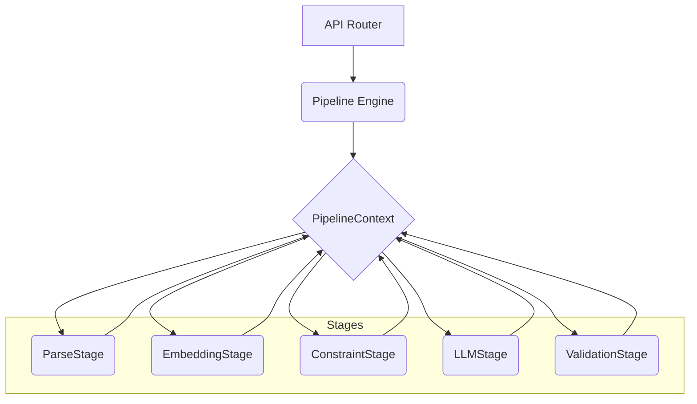

# ResumeIQ System Design

This document outlines the high-level architecture, pipeline orchestration, and extension rules for the ResumeIQ platform.

## 1. Architectural Overview
ResumeIQ uses a lightweight, loosely-coupled pipeline architecture. Instead of hardcoding AI workflows into large monolithic services, we compose linear arrays of `PipelineStage` objects.

State is managed via a unified `PipelineContext` object that flows sequentially through these stages.

### Component Diagram


## 2. Event-Driven Observability
To prevent stages from becoming tightly coupled to metrics, logging, and tracing services, we utilize an **Event System**.

Stages simply emit events (e.g., `StageCompletedEvent`). Background listeners catch these events and write to logs, Datadog, Prometheus, or standard output.

## 3. The Extension API
Every new AI capability MUST be implemented by composing existing stages or introducing a new stage that implements the `PipelineStage` interface.

```python
class PipelineStage(ABC):
    @abstractmethod
    async def execute(self, context: PipelineContext) -> None:
        pass
```

### Freeze Rules
1. Reuse existing stages whenever possible.
2. Only create a new stage if it represents a distinct processing step.
3. Keep `PipelineContext` as the single object flowing through the pipeline.
4. Emit events rather than directly calling monitoring or logging.
5. Validate all LLM outputs before exposing them.

## 4. Multi-Layer Validation
LLM outputs are inherently non-deterministic. Every LLM response flows through a validation pipeline:
1. **Schema Validation**: Is the JSON parseable and structurally correct?
2. **Business Validation**: Do the extracted skills actually exist in the resume?
3. **Quality Validation**: Is the generated response useful?
4. **Safety Validation**: Is this a prompt injection attack?
